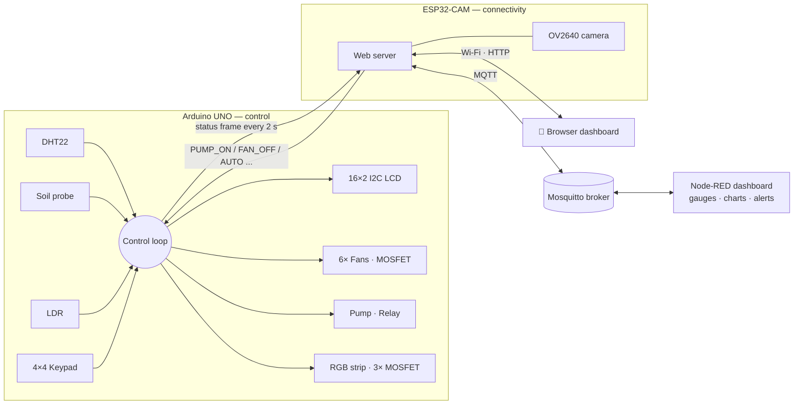
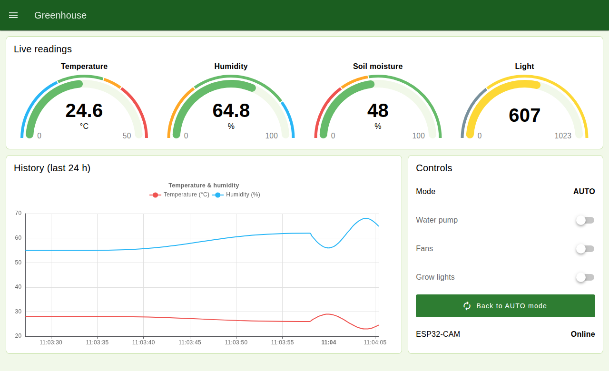

# 🌱 Smart Greenhouse — Arduino UNO + ESP32-CAM


An automated indoor greenhouse. It measures temperature, humidity, soil moisture and light, and drives fans, a water pump and an RGB grow-light strip on its own. You can monitor and control it three ways:
- a **16×2 LCD** and **4×4 keypad** on the device itself;
- a **Wi-Fi web dashboard**, with a live camera snapshot from the ESP32-CAM;
- **MQTT** with a **Node-RED dashboard**: gauges, 24-hour history charts, remote switches and alerts;
- **automatic mode**, which runs everything without you.

The system is split across two controllers that talk over **UART**:

- **Arduino UNO: real-time control.** Reads the sensors, runs the control loop and drives the actuators, the LCD and the keypad.
- **ESP32-CAM: connectivity.** Runs the Wi-Fi web server and the camera, publishes the state over **MQTT**, and forwards commands from the web dashboard or MQTT to the UNO.

---

## ✨ Features

- **Automatic climate control** with **hysteresis**, so the fans, pump and lights don't flicker on and off around a threshold.
- **Pump safety:**
  - One watering run lasts **30 s at most**. After that the pump rests for **60 s**, so the water can soak in.
  - The limit applies in manual mode too. A faulty probe or a forgotten command can't flood the greenhouse.
- **Soil moisture in %**, with a two-point calibration: dry air and water.
- **Keypad control:**
  - Toggle each actuator manually.
  - View the thresholds.
  - **Edit the thresholds on the device.** They are saved in **EEPROM**, so they survive a power cut.
- **Non-blocking firmware:** the loop is timed with `millis()` and never uses `delay()`. The keypad and the UART are polled continuously, so no key press or command is missed.
- **Web dashboard:**
  - A single page that works well on phones.
  - Refreshes live over a small JSON API, without reloading the page.
  - Shows each actuator's state and a camera snapshot.
  - Warns you when the Arduino link is down.
- **MQTT integration:**
  - The state is published as retained JSON every 2 s.
  - Commands are accepted on their own topic.
  - A **last-will** message marks the device "offline" if the ESP32 drops off the network.
  - Reconnection is non-blocking, so the web dashboard keeps working even when the broker is down.
- **Node-RED dashboard**, ready to import:
  - Live gauges and a 24-hour history chart.
  - Switches for the pump, fans and lights, plus an AUTO button.
  - Pop-up alerts for high temperature, dry soil, a lost Arduino link and a sensor fault.
- **Command whitelist** on the ESP32. Web and MQTT commands both go through it, and only known commands reach the controller.
- **Wi-Fi credentials** live in a git-ignored `secrets.h`, so they never end up in the repository.

## 🧭 Architecture



## 🧰 Hardware

| Part | Qty | Purpose |
|---|---|---|
| Arduino UNO | 1 | Sensors, control loop, actuators, LCD, keypad |
| ESP32-CAM (AI-Thinker) | 1 | Wi-Fi dashboard and camera |
| DHT22 | 1 | Temperature and humidity |
| Soil-moisture probe (analog) | 1 | Soil dryness |
| LDR + 10 kΩ | 1 | Ambient light |
| 16×2 LCD with I2C backpack | 1 | Live readings |
| 4×4 membrane keypad | 1 | Manual control and settings |
| 12 V fan | 6 | Cooling and ventilation |
| 12 V water pump + relay module | 1 | Irrigation |
| 12 V RGB LED strip | 1 | Grow light |
| Logic-level N-MOSFET (e.g. IRLZ44N) | 4 | Fans and the 3 LED channels |
| 1N4007 diodes, 220 Ω / 10 kΩ / 1 kΩ / 2 kΩ resistors, bulk capacitors | — | Protection, gate drive, UART level shifting |
| 12 V / 5 A supply + 5 V supply | 1 each | Power |

## 📌 Pin map (Arduino UNO)

| Device | Pin | | Device | Pin |
|---|---|---|---|---|
| DHT22 data | D2 | | Fans MOSFET gate | D11 |
| Keypad rows R1–R4 | D3–D6 | | Pump relay IN | D12 |
| Keypad cols C1–C4 | D7–D10 | | LED red MOSFET gate | D13 |
| Soil probe AO | A0 | | LED green MOSFET gate | A2 |
| LDR divider | A1 | | LED blue MOSFET gate | A3 |
| LCD SDA / SCL | A4 / A5 | | UART TX → ESP32 RX / RX ← ESP32 TX | D1 / D0 |

The complete wiring, with the MOSFET drivers, the relay, the UART level shifter and the power rails, is in **[docs/wiring.md](docs/wiring.md)**.

## 🔌 UART protocol

Both sides use **9600 baud, 8N1**, and each message is one text line.

**UNO → ESP32**, every 2 s and after every change:
```
T:25.3,H:61.0,S:42,L:512,F:1,P:0,E:1,M:A
```
| Key | Meaning |
|---|---|
| `T` | Temperature in °C |
| `H` | Humidity in % |
| `S` | Soil moisture in % |
| `L` | Light, raw 0–1023 |
| `F` | Fans on/off |
| `P` | Pump on/off |
| `E` | LEDs on/off |
| `M` | Mode: `A` auto, `M` manual |

**ESP32 → UNO**, one command per line:

| Command | Effect |
|---|---|
| `PUMP_ON` / `PUMP_OFF` | Pump on or off (switches to manual mode) |
| `FAN_ON` / `FAN_OFF` | Fans on or off (switches to manual mode) |
| `LED_ON` / `LED_OFF` | Grow lights on or off (switches to manual mode) |
| `AUTO` | Back to automatic mode |

## 🌐 Web dashboard

| Endpoint | Returns |
|---|---|
| `GET /` | The dashboard page |
| `GET /status` | JSON with the readings, actuator states, mode and link status |
| `GET /ctrl?cmd=PUMP_ON` | Forwards a whitelisted command to the Arduino |
| `GET /capture` | One JPEG frame from the camera |

## 📡 MQTT & Node-RED



### Topics

| Topic | Direction | Payload |
|---|---|---|
| `greenhouse/state` | ESP32 → broker (retained, every 2 s) | JSON state (see below) |
| `greenhouse/availability` | ESP32 → broker (retained, last will) | `online` / `offline` |
| `greenhouse/cmd` | broker → ESP32 | `PUMP_ON` `PUMP_OFF` `FAN_ON` `FAN_OFF` `LED_ON` `LED_OFF` `AUTO` |

```json
{"online":true,"temperature":26.4,"humidity":61.0,"soil":47,"light":612,
 "fan":false,"pump":false,"leds":false,"auto":true,"camera":true}
```

`online` is `false` when the ESP32 has had no frame from the UNO for 10 s. `temperature` and `humidity` are `null` when the DHT22 read fails.

You can test the whole setup from a terminal:
```bash
mosquitto_sub -t 'greenhouse/#' -v             # watch everything
mosquitto_pub -t greenhouse/cmd -m PUMP_ON     # water now (switches to manual mode)
mosquitto_pub -t greenhouse/cmd -m AUTO        # back to automatic control
```

### Setting up the broker and Node-RED

Run these on a PC or Raspberry Pi on the same network as the greenhouse.

1. **Mosquitto broker.** Mosquitto 2.x only accepts local connections by default, so allow the ESP32 in `mosquitto.conf`:
   ```
   listener 1883
   allow_anonymous true    # or set up password_file and use MQTT_USER / MQTT_PASSWORD
   ```
2. **Node-RED.** Install it, then install **`@flowfuse/node-red-dashboard`** (Dashboard 2.0) from *Menu → Manage palette → Install*.
3. **Import the flow.** Go to *Menu → Import* and select [`node-red/greenhouse-flow.json`](node-red/greenhouse-flow.json). Then click **Deploy**.
   - The flow connects to a broker on `localhost:1883`. If yours runs elsewhere, change that in the *Local Mosquitto* config node.
   - The alert limits (`ALERT_TEMP_C = 35`, `ALERT_SOIL_PCT = 20`) are environment variables on the flow tab.
4. **Open the dashboard** at `http://<node-red-host>:1880/dashboard/greenhouse`.
5. **Connect the ESP32.** In `secrets.h`, set `MQTT_HOST` to the broker's IP address.

The flow was tested end-to-end against Mosquitto 2, Node-RED 5.0 and Dashboard 2.0 (v1.32):
- Simulated state messages appear on the gauges, the chart and the switches.
- Clicking a switch or the AUTO button publishes the right command.
- Incoming state updates never produce commands, so there is no feedback loop.

## ⌨️ Keypad

| Key | Action |
|---|---|
| `A` | Pump on/off (manual mode) |
| `B` | Fans on/off (manual mode) |
| `C` | Grow lights on/off (manual mode) |
| `D` | Show the current thresholds |
| `*` | Back to AUTO mode |
| `#` | Edit the thresholds (see below) |

**Editing the thresholds:**
1. Press `#` to start.
2. For each value in turn — fan temperature, then soil %, then light level — type the new number and press `#`. To keep the current value, just press `#`.
3. After the last value the settings are saved to EEPROM. Press `*` at any point to cancel.

## 🚀 Getting started

1. **Arduino libraries.** Install these from the Library Manager:
   - *DHT sensor library* (Adafruit)
   - *LiquidCrystal I2C*
   - *Keypad* (Mark Stanley)
2. **ESP32 board support.** Install *esp32 by Espressif* from the Boards Manager, then select **AI Thinker ESP32-CAM**. Also install the **PubSubClient** library (Nick O'Leary).
3. **Wi-Fi and MQTT.** In `firmware/greenhouse_esp32cam/`, copy `secrets.example.h` to `secrets.h`. Put your network name and password in it, plus the MQTT broker address. Leave `MQTT_HOST` empty to use the built-in web dashboard only.
4. **Calibrate the soil probe.** Note its reading in dry air and in a glass of water. Set `SOIL_RAW_DRY` and `SOIL_RAW_WET` at the top of `greenhouse_uno.ino` to those values.
5. **Upload the UNO sketch.** ⚠️ Unplug the ESP32 wire from **D0 (RX)** first. That pin is shared with the USB upload.
6. **Upload the ESP32-CAM sketch** with a USB-serial adapter: IO0 → GND while flashing, then remove it and reset.
7. **Find the dashboard address.**
   - The ESP32 prints `DASHBOARD http://<ip>` at boot, so you can read it from the programmer's serial monitor at 9600 baud.
   - Or find the device in your router's client list.
   - Then open that address in a browser on the same Wi-Fi network.

### Hardware options

These are constants at the top of `greenhouse_uno.ino`:

| Setting | Default | Change it when… |
|---|---|---|
| `LCD_ADDRESS` | `0x27` | The screen stays blank: try `0x3F` |
| `RELAY_ACTIVE_LOW` | `false` | Your relay board switches ON when IN is LOW |
| `PUMP_MAX_ON_MS` / `PUMP_REST_MS` | 30 s / 60 s | You use a larger pot or a different pump |

## ⚡ Power budget

| Load | Supply | Current |
|---|---|---|
| 6× fans | 12 V | ~1.5 A |
| Water pump | 12 V | ~1.0 A |
| LED strip | 12 V | ~1.0 A |
| Arduino + sensors + LCD | 5 V | ~0.2 A |
| ESP32-CAM | 5 V | ~0.3 A (peaks higher with Wi-Fi + camera) |
| **Total** | **12 V / 5 A PSU** | **~4 A** |

All grounds must meet on **one common GND rail**: the Arduino, both supplies, every MOSFET source and the relay. Follow the [safe first power-on sequence](docs/wiring.md#safe-first-power-on) before connecting 12 V.

## 🛠️ Troubleshooting

| Symptom | Likely cause | Fix |
|---|---|---|
| LCD shows `DHT22 error!` | Missing pull-up | 10 kΩ between DHT22 DATA and 5 V |
| LCD blank | Wrong I2C address | Set `LCD_ADDRESS` to `0x3F` |
| Fans always on | Gate floating | 10 kΩ gate → GND pull-down |
| Pump runs when the soil is wet | Probe not calibrated | Set `SOIL_RAW_DRY` / `SOIL_RAW_WET` |
| Relay works backwards | Active-low relay board | `RELAY_ACTIVE_LOW = true` |
| Dashboard: "Arduino offline" | UART wiring | UNO TX → divider → ESP32 U0R, ESP32 U0T → UNO RX, common GND |
| Upload to the UNO fails | ESP32 on D0 | Unplug the ESP32 TX wire while uploading |
| Node-RED shows no data | ESP32 can't reach the broker | Set `MQTT_HOST` to the broker's LAN IP; Mosquitto 2 needs `listener 1883` + `allow_anonymous true` (or credentials) |
| ESP32-CAM keeps rebooting | Brown-out | Stable 5 V supply with ≥ 1 A, plus a 470 µF capacitor close to the board |

## 📁 Project structure

```
GreenHouse/
├── firmware/
│   ├── greenhouse_uno/
│   │   └── greenhouse_uno.ino        # Arduino UNO: sensors, control loop, LCD, keypad, UART
│   └── greenhouse_esp32cam/
│       ├── greenhouse_esp32cam.ino   # ESP32-CAM: Wi-Fi server, MQTT, camera, command bridge
│       ├── dashboard_html.h          # the dashboard web page
│       └── secrets.example.h         # copy to secrets.h (git-ignored)
├── node-red/
│   └── greenhouse-flow.json          # Node-RED Dashboard 2.0 flow (import it)
├── docs/
│   ├── wiring.md                     # full wiring guide and power-on checklist
│   └── images/                       # screenshots
└── README.md
```

## 🔭 Possible next steps

- Home Assistant MQTT auto-discovery.
- Long-term storage of readings in InfluxDB, with Grafana dashboards.
- Over-the-air (OTA) firmware updates for the ESP32-CAM.
- PWM dimming and colour control for the RGB grow light.

## 👤 Author

**Mohammed El-SiSi** — Embedded Software Engineer
[LinkedIn](https://www.linkedin.com/in/mohammed-eli3) · [GitHub](https://github.com/Mkko000)

Released under the [MIT License](LICENSE).
